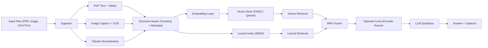

# Multimodal RAG System


Production-style multimodal Retrieval-Augmented Generation (RAG) system for real-world documents.

## Overview

This project ingests and queries:
- PDFs (layout-aware text + table extraction)
- images (vision captions + optional OCR)
- CSV/TSV tabular files

It ships with:
- a reusable Python package (`src` layout)
- a CLI (`mmrag`) for local workflows
- a FastAPI REST service for product integration
- Docker support for deployable runtime

## What Makes It Strong

- Hybrid retrieval: dense vector search + lexical BM25
- Reciprocal Rank Fusion (RRF) for robust ranking
- Weighted RRF controls to tune text/table/image/lexical influence
- Adaptive corrective retrieval fallback for low-coverage first-pass results
- Optional multi-query decomposition for multi-intent questions
- Optional grounded-answer guardrail with citation minimum and fallback response
- Optional cross-encoder reranker for precision
- Result diversification (near-duplicate suppression + per-source balancing)
- Citation-rich answers (`source`, `modality`, `page`, `excerpt`)
- Pluggable vector backends (`faiss` and `qdrant`)
- Layout-aware PDF ingestion with table-region text dedup
- Adaptive chunk sizing by section style (narrative/procedural/table-like)
- Idempotent source refresh on re-ingest (no duplicate chunk buildup)
- Incremental ingest skips unchanged files by fingerprint for faster refresh cycles

## System Architecture



## Quickstart

```bash
cd multimodal-rag-system
python -m venv .venv
.venv\Scripts\activate
pip install -e ".[dev,vision]"
copy .env.example .env
```

For tracing and metrics export, install with observability extras:

```bash
pip install -e ".[dev,vision,observability]"
```

```bash
mmrag ingest ./data --tenant acme
mmrag ask "What are the major metrics shown in the latest PDF tables?" --tenant acme
mmrag ask "Summarize contract risks" --tenant acme --retrieval-mode hybrid_rerank
mmrag ask "Find charts similar to this trend" --image ./data/query_chart.png --tenant acme
mmrag serve --host 0.0.0.0 --port 8000
```

API docs: `http://localhost:8000/docs`

## Docker

```bash
docker compose up --build
```

## Local Deployment (Windows)

Use the operational scripts for repeatable local deployment:

```powershell
.\scripts\deploy_local.ps1
.\scripts\status_local.ps1
.\scripts\restart_local.ps1
.\scripts\stop_local.ps1
```

## API Surface

- `GET /health`
- `POST /ingest-paths`
- `POST /ingest-jobs` (enqueue background ingestion)
- `GET /ingest-jobs/{job_id}` (check ingestion status)
- `POST /ingest-jobs/{job_id}/cancel` (cancel queued ingestion job)
- `GET /ingest-jobs` (list recent ingestion jobs)
- `POST /ingest-files`
- `POST /query`
- `POST /query-stream` (SSE stream: meta, token deltas, citations, done)
- `POST /query-multimodal` (multipart: question + optional image)
- all endpoints return a request correlation header (default `X-Request-ID`)

`POST /query` returns:
- `answer`
- `sources` (retrieved chunks + score)
- `citations` (source file, modality, page number, excerpt)
- `retrieval_mode` (effective mode used by the engine)
- `corrected` (whether fallback corrective retrieval was applied)
- `grounded` (whether citation minimum is satisfied)
- `retrieval_diagnostics` (initial/final retrieval quality stats)
- `latency_ms` (request retrieval+generation time)
- accepts optional `retrieval_mode` (`dense_only`, `hybrid`, `hybrid_rerank`)

Example multimodal query:

```bash
curl -X POST http://localhost:8000/query-multimodal \
  -H "X-Tenant-ID: acme" \
  -F "question=Find similar chart patterns" \
  -F "image=@./data/query_chart.png"
```

Example async ingestion job:

```bash
curl -X POST http://localhost:8000/ingest-jobs \
  -H "Content-Type: application/json" \
  -H "X-Tenant-ID: acme" \
  -d "{\"paths\": [\"./data\"], \"collection\": \"default\"}"
```

## Observability (OpenTelemetry)

Built-in request tracing and metrics hooks are available for production monitoring:
- request-level instrumentation middleware with configurable request ID header
- query latency metrics (`/query`, `/query-stream`, `/query-multimodal`)
- OTLP HTTP exporter support (Tempo, Jaeger, Grafana, Honeycomb, etc.)
- optional console exporter for local debugging

Enable it with environment variables:
- `MMRAG_OBSERVABILITY_ENABLED=true`
- `MMRAG_OBSERVABILITY_SERVICE_NAME=multimodal-rag-system`
- `MMRAG_OBSERVABILITY_OTLP_ENDPOINT=http://localhost:4318`
- `MMRAG_OBSERVABILITY_TRACE_SAMPLE_RATIO=1.0`
- `MMRAG_REQUEST_ID_HEADER=X-Request-ID`

## Rate Limiting

Optional token-bucket limiting is available for query endpoints (`/query`, `/query-stream`, `/query-multimodal`):
- `MMRAG_RATE_LIMIT_ENABLED=true`
- `MMRAG_RATE_LIMIT_REQUESTS_PER_MINUTE=120`
- `MMRAG_RATE_LIMIT_BURST=60`

When throttled, the API responds with HTTP `429` and `Retry-After`.

## Multi-Tenant & API Auth

Tenant scoping is enabled by default across ingestion and retrieval:
- each tenant writes to an isolated namespaced collection (`tenant-<id>__<collection>`)
- CLI supports `--tenant` on `ingest`, `ask`, and `eval`
- REST API uses `X-Tenant-ID` (configurable via `MMRAG_AUTH_TENANT_HEADER`)

Optional API-key auth (recommended for deployments):
- set `MMRAG_AUTH_ENABLED=true`
- configure `MMRAG_AUTH_TENANT_API_KEYS` as `tenant_a:key_a,tenant_b:key_b`
- send the API key header (default `X-API-Key`)
- when a tenant header is supplied, it must match the tenant bound to the API key

## Benchmarking

The project includes built-in retrieval benchmarking and ablation tooling, plus CI smoke evaluation.
Track and report these metrics for your datasets:
- `Recall@k`
- `MRR`
- citation hit-rate / citation precision
- average and p95 end-to-end latency

## Evaluation Harness

Run structured retrieval benchmarks with the built-in evaluator:

```bash
mmrag eval ./eval/datasets/starter_eval.jsonl --ingest-path ./data --tenant acme --k-values 1,3,5,10
```

Run retrieval strategy ablations:

```bash
mmrag eval ./eval/datasets/starter_eval.jsonl --ingest-path ./data --tenant acme --ablation
```

What it reports:
- `Recall@k` (for configured k values)
- `MRR`
- citation hit-rate
- mean citation precision
- average and p95 latency

The command saves a JSON report under `.rag_store/eval_reports/` by default.

## Resume-Ready Outcomes

This project demonstrates:
- end-to-end LLM product engineering (ingestion to API)
- retrieval engineering beyond dense-only pipelines
- production-aware Python packaging and deployment
- configurable AI systems with clean interfaces and fallbacks
- testing and code quality workflows (`pytest`, `ruff`)

## Configuration

Important env variables:
- `MMRAG_VECTOR_BACKEND`
- `MMRAG_STORAGE_DIR`
- `MMRAG_COLLECTION`
- `MMRAG_DEFAULT_TENANT`
- `MMRAG_CHUNK_SIZE`
- `MMRAG_CHUNK_OVERLAP`
- `MMRAG_INGESTION_SKIP_UNCHANGED_FILES`
- `MMRAG_INGESTION_JOBS_ENABLED`
- `MMRAG_INGESTION_JOBS_MAX_WORKERS`
- `MMRAG_INGESTION_JOBS_TTL_SECONDS`
- `MMRAG_INGESTION_JOBS_MAX_RETAINED`
- `MMRAG_ADAPTIVE_CHUNKING_ENABLED`
- `MMRAG_ADAPTIVE_CHUNKING_MIN_SIZE`
- `MMRAG_ADAPTIVE_CHUNKING_TABLE_FACTOR`
- `MMRAG_ADAPTIVE_CHUNKING_PROCEDURAL_FACTOR`
- `MMRAG_ADAPTIVE_CHUNKING_NARRATIVE_FACTOR`
- `MMRAG_ADAPTIVE_CHUNKING_OVERLAP_FACTOR`
- `MMRAG_OPENAI_API_KEY`
- `MMRAG_RETRIEVAL_TOP_K_PER_MODALITY`
- `MMRAG_RETRIEVAL_TOP_K_LEXICAL`
- `MMRAG_RETRIEVAL_RRF_K`
- `MMRAG_RETRIEVAL_RRF_WEIGHT_TEXT`
- `MMRAG_RETRIEVAL_RRF_WEIGHT_TABLE`
- `MMRAG_RETRIEVAL_RRF_WEIGHT_IMAGE`
- `MMRAG_RETRIEVAL_RRF_WEIGHT_LEXICAL`
- `MMRAG_RETRIEVAL_ENABLE_RERANKER`
- `MMRAG_RETRIEVAL_RERANKER_MODEL`
- `MMRAG_RETRIEVAL_RERANK_CANDIDATES`
- `MMRAG_RETRIEVAL_ENABLE_RESULT_DIVERSITY`
- `MMRAG_RETRIEVAL_MAX_CHUNKS_PER_SOURCE`
- `MMRAG_RETRIEVAL_DUPLICATE_SIMILARITY_THRESHOLD`
- `MMRAG_RETRIEVAL_QUERY_EXPANSION_ENABLED`
- `MMRAG_RETRIEVAL_QUERY_EXPANSION_MAX_VARIANTS`
- `MMRAG_RETRIEVAL_QUERY_EXPANSION_WEIGHT`
- `MMRAG_RETRIEVAL_AUTO_CORRECT_ENABLED`
- `MMRAG_RETRIEVAL_AUTO_CORRECT_MIN_HITS`
- `MMRAG_RETRIEVAL_AUTO_CORRECT_MIN_UNIQUE_SOURCES`
- `MMRAG_RETRIEVAL_AUTO_CORRECT_MIN_UNIQUE_MODALITIES`
- `MMRAG_RETRIEVAL_AUTO_CORRECT_TARGET_MODE`
- `MMRAG_RETRIEVAL_AUTO_CORRECT_TOP_K_MULTIPLIER`
- `MMRAG_RETRIEVAL_AUTO_CORRECT_LEXICAL_MULTIPLIER`
- `MMRAG_RESPONSE_REQUIRE_CITATIONS`
- `MMRAG_RESPONSE_MIN_CITATIONS`
- `MMRAG_RESPONSE_UNGROUNDED_FALLBACK_TEXT`
- `MMRAG_REQUEST_ID_HEADER`
- `MMRAG_RATE_LIMIT_ENABLED`
- `MMRAG_RATE_LIMIT_REQUESTS_PER_MINUTE`
- `MMRAG_RATE_LIMIT_BURST`
- `MMRAG_OBSERVABILITY_ENABLED`
- `MMRAG_OBSERVABILITY_SERVICE_NAME`
- `MMRAG_OBSERVABILITY_OTLP_ENDPOINT`
- `MMRAG_OBSERVABILITY_CONSOLE_EXPORTER`
- `MMRAG_OBSERVABILITY_TRACE_SAMPLE_RATIO`
- `MMRAG_AUTH_ENABLED`
- `MMRAG_AUTH_API_KEY_HEADER`
- `MMRAG_AUTH_TENANT_HEADER`
- `MMRAG_AUTH_TENANT_API_KEYS`
- `MMRAG_QDRANT_URL`
- `MMRAG_QDRANT_API_KEY`
- `MMRAG_QDRANT_PATH`

## CLI

- `mmrag ingest <path> [--tenant <tenant-id>]`
- `mmrag ask <question> [--tenant <tenant-id>] [--retrieval-mode <mode>]`
- `mmrag ask <question> --image <path-to-image> [--tenant <tenant-id>] [--retrieval-mode <mode>]`
- `mmrag serve`
- `mmrag eval <dataset-path> [--tenant <tenant-id>] [--ablation]`

Run `mmrag --help` for full options.

## Development

```bash
ruff check src tests
pytest -q
```

CI pipeline (`.github/workflows/ci.yml`) enforces:
- lint + tests across Python `3.10`, `3.11`, `3.12`
- retrieval evaluation smoke run (`python scripts/run_eval_smoke.py`)

## Project Structure

```text
src/multimodal_rag/
  ingestion/      # loaders, chunking, pdf/image/table extraction
  embedding/      # text + vision embedders
  storage/        # faiss and qdrant backends
  retrieval/      # lexical index, RRF fusion, reranker
  generation/     # answer synthesis
  api/            # FastAPI app and schemas
```
