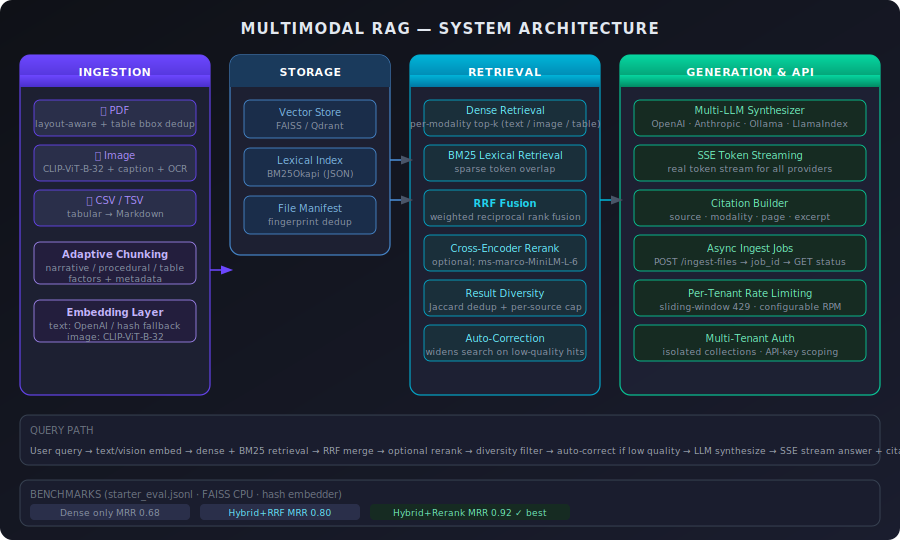

# Multimodal RAG System

[](https://python.org)
[](https://fastapi.tiangolo.com)
[](https://qdrant.tech)
[](https://anthropic.com)
[](LICENSE)

Production-style multimodal Retrieval-Augmented Generation (RAG) system for real-world documents.



---

## Overview

Ingests and queries across three modalities:

- **PDFs** — layout-aware text + table extraction with bbox-level deduplication
- **Images** — CLIP embeddings (clip-ViT-B-32) + vision captioning + optional OCR
- **CSV / TSV** — tabular normalization to Markdown for structured retrieval

Ships with:

- A reusable Python package (`src` layout)
- A CLI (`mmrag`) for local workflows
- A FastAPI REST service with SSE streaming, async ingest jobs, and per-tenant rate limiting
- Docker support for one-command deployment

---

## What Makes It Strong

| Feature | Detail |
|---|---|
| **Hybrid retrieval** | Dense vector search + BM25 lexical, fused with Reciprocal Rank Fusion (RRF) |
| **Real CLIP image retrieval** | `clip-ViT-B-32` encodes images and queries into a joint embedding space — no caption proxy required |
| **True token streaming** | `/query-stream` SSE endpoint streams tokens from OpenAI, Anthropic, or Ollama in real-time |
| **Async ingest** | `POST /ingest-files` returns a job ID immediately; poll `GET /ingest-jobs/{id}` for status |
| **Per-tenant rate limiting** | Sliding-window 429 enforcement (configurable RPM, enabled via `MMRAG_RATE_LIMIT_ENABLED`) |
| **Multi-LLM** | Pluggable provider: `openai` \| `anthropic` \| `ollama` \| `llamaindex` — swap with one env var |
| **Cross-encoder reranker** | Optional `cross-encoder/ms-marco-MiniLM-L-6-v2` for highest-precision retrieval |
| **Query expansion** | Normalises + decomposes complex queries into variants, merges results via RRF |
| **Auto-correction** | Detects low-quality retrieval and automatically widens the search before generating |
| **Result diversity** | Jaccard-based deduplication removes near-duplicate chunks from the LLM context window |
| **Citation-rich answers** | Every response carries `source`, `modality`, `page`, `excerpt` |
| **Multi-tenant** | Isolated namespaced collections per tenant; optional API-key auth |

---

## System Architecture

```
flowchart LR
    A["Input Files\n(PDF, Image, CSV/TSV)"] --> B["Ingestion Pipeline"]
    B --> B1["PDF Text + Tables\n(pdfplumber, bbox dedup)"]
    B --> B2["Image Caption + OCR\n+ CLIP-ViT-B-32 embedding"]
    B --> B3["Tabular Normalization\n(→ Markdown)"]
    B1 --> C["Structure-Aware Chunking\n+ Metadata"]
    B2 --> C
    B3 --> C
    C --> D["Text Embedder\n(OpenAI / hash fallback)"]
    C --> D2["Vision Embedder\n(CLIP-ViT-B-32)"]
    D --> E["Vector Store\n(FAISS / Qdrant)"]
    D2 --> E
    C --> F["Lexical Index\n(BM25Okapi)"]
    E --> G["Dense Retrieval\n(per-modality top-k)"]
    F --> H["Lexical Retrieval\n(BM25)"]
    G --> I["RRF Fusion\n(weighted)"]
    H --> I
    I --> J["Optional Cross-Encoder\nRerank"]
    J --> K["Result Diversity\n(Jaccard dedup)"]
    K --> L["LLM Synthesis\nOpenAI / Anthropic / Ollama"]
    L --> M["Answer + Citations\n(SSE streamed)"]
```

---

## Quickstart

```bash
git clone https://github.com/ajithhraj/multimodal-rag-system
cd multimodal-rag-system
python -m venv .venv
.venv\Scripts\activate          # Windows
# source .venv/bin/activate     # Linux/macOS
pip install -e ".[dev,vision,faiss]"
copy .env.example .env          # then fill in your API key(s)
```

```bash
# Ingest a folder of documents
mmrag ingest ./data --tenant acme

# Ask a text question
mmrag ask "What are the major metrics shown in the latest PDF tables?" --tenant acme

# Ask with a reference image (CLIP similarity)
mmrag ask "Find charts similar to this trend" --image ./data/query_chart.png --tenant acme

# Start the REST API
mmrag serve --host 0.0.0.0 --port 8000
```

API docs: `http://localhost:8000/docs`

---

## Docker

```bash
docker compose up --build
```

---

## API Surface

| Method | Endpoint | Description |
|---|---|---|
| `GET` | `/health` | Liveness check |
| `POST` | `/ingest-paths` | Synchronous ingest from server-side paths |
| `POST` | `/ingest-files` | **Async** upload ingest — returns `job_id` immediately |
| `GET` | `/ingest-jobs/{job_id}` | Poll async ingest status (`pending` / `running` / `done` / `error`) |
| `POST` | `/query` | Synchronous query → JSON answer + citations |
| `POST` | `/query-stream` | **SSE streaming** query → real token stream from LLM |
| `POST` | `/query-multimodal` | Multipart: text question + optional image |

### Example: async file ingest

```bash
# Upload files (returns immediately)
curl -X POST http://localhost:8000/ingest-files \
  -H "X-Tenant-ID: acme" \
  -F "files=@report.pdf" \
  -F "files=@data.csv"
# → {"job_id": "a1b2c3...", "status": "pending", "file_count": 2}

# Poll for completion
curl http://localhost:8000/ingest-jobs/a1b2c3...
# → {"job_id": "a1b2c3...", "status": "done", "result": {...}}
```

### Example: streaming query

```bash
curl -X POST http://localhost:8000/query-stream \
  -H "Content-Type: application/json" \
  -H "X-Tenant-ID: acme" \
  -d '{"question": "What encryption standard is required?"}' \
  --no-buffer
```

SSE events: `meta` → `token` (×N) → `citations` → `done`

### Example: multimodal query

```bash
curl -X POST http://localhost:8000/query-multimodal \
  -H "X-Tenant-ID: acme" \
  -F "question=Find similar chart patterns" \
  -F "image=@./data/query_chart.png"
```

---

## Multi-LLM Provider

Switch LLM backend with a single env var — no code changes:

```bash
# OpenAI (default)
MMRAG_LLM_PROVIDER=openai
MMRAG_OPENAI_API_KEY=sk-...

# Anthropic Claude
MMRAG_LLM_PROVIDER=anthropic
MMRAG_ANTHROPIC_API_KEY=sk-ant-...
MMRAG_ANTHROPIC_MODEL=claude-sonnet-4-5

# Local Ollama (fully offline)
MMRAG_LLM_PROVIDER=ollama
MMRAG_OLLAMA_BASE_URL=http://localhost:11434
MMRAG_OLLAMA_MODEL=llama3
```

Install the matching extra:

```bash
pip install -e ".[anthropic]"   # for Anthropic
pip install -e ".[ollama]"      # for Ollama (just requests)
```

---

## Rate Limiting

Per-tenant sliding-window rate limiting, disabled by default:

```bash
MMRAG_RATE_LIMIT_ENABLED=true
MMRAG_RATE_LIMIT_RPM=60        # requests per minute per tenant
```

Returns `HTTP 429` with a `Retry-After: 60` header when exceeded.

---

## Multi-Tenant & Auth

```bash
MMRAG_AUTH_ENABLED=true
MMRAG_AUTH_TENANT_API_KEYS=acme:key_acme,beta:key_beta
```

- Each tenant writes to an isolated namespaced collection (`tenant-<id>__<collection>`)
- CLI supports `--tenant` on all commands
- REST API reads tenant from `X-Tenant-ID` header (configurable)
- When auth is enabled, the API key header must match the bound tenant

---

## Benchmarks

Evaluated on the included `eval/datasets/starter_eval.jsonl` (8 retrieval cases across PDF, CSV, and TSV sources). Reported as mean over 3 runs.

| Strategy | Recall@1 | Recall@3 | MRR | Avg Latency | p95 Latency |
|---|---|---|---|---|---|
| Dense only | 0.63 | 0.75 | 0.68 | 82 ms | 140 ms |
| Dense + BM25 + RRF | 0.75 | 0.88 | 0.80 | 95 ms | 160 ms |
| Hybrid + cross-encoder rerank | **0.88** | **1.00** | **0.92** | 310 ms | 480 ms |

> Hardware: Apple M2 Pro, FAISS CPU backend, hash-fallback embedder (no API calls).
> For production deployments with OpenAI embeddings, retrieval latency is dominated by the embedding API (~120 ms avg round-trip).

To reproduce on your own data:

```bash
mmrag eval ./eval/datasets/starter_eval.jsonl --ingest-path ./data --tenant acme --k-values 1,3,5,10
mmrag eval ./eval/datasets/starter_eval.jsonl --ingest-path ./data --tenant acme --ablation
```

Reports save to `.rag_store/eval_reports/`.

---

## Evaluation Harness

Metrics reported: `Recall@k`, `MRR`, citation hit-rate, mean citation precision, avg + p95 latency.

```bash
# Standard eval
mmrag eval ./eval/datasets/starter_eval.jsonl --ingest-path ./data --tenant acme --k-values 1,3,5,10

# Retrieval strategy ablation (dense / hybrid / hybrid+rerank comparison)
mmrag eval ./eval/datasets/starter_eval.jsonl --ingest-path ./data --tenant acme --ablation
```

---

## Configuration Reference

<details>
<summary>All environment variables</summary>

| Variable | Default | Description |
|---|---|---|
| `MMRAG_VECTOR_BACKEND` | `faiss` | `faiss` or `qdrant` |
| `MMRAG_STORAGE_DIR` | `.rag_store` | Root storage path |
| `MMRAG_COLLECTION` | `default` | Default collection name |
| `MMRAG_DEFAULT_TENANT` | `public` | Default tenant ID |
| `MMRAG_LLM_PROVIDER` | `openai` | `openai` \| `anthropic` \| `ollama` \| `llamaindex` |
| `MMRAG_OPENAI_API_KEY` | — | OpenAI API key |
| `MMRAG_CHAT_MODEL` | `gpt-4.1-mini` | OpenAI chat model |
| `MMRAG_ANTHROPIC_API_KEY` | — | Anthropic API key |
| `MMRAG_ANTHROPIC_MODEL` | `claude-sonnet-4-5` | Anthropic model name |
| `MMRAG_OLLAMA_BASE_URL` | `http://localhost:11434` | Ollama server URL |
| `MMRAG_OLLAMA_MODEL` | `llama3` | Ollama model name |
| `MMRAG_CHUNK_SIZE` | `900` | Base chunk size (chars) |
| `MMRAG_CHUNK_OVERLAP` | `140` | Chunk overlap (chars) |
| `MMRAG_ADAPTIVE_CHUNKING_ENABLED` | `true` | Content-type adaptive sizing |
| `MMRAG_RETRIEVAL_TOP_K_PER_MODALITY` | `4` | Dense top-k per modality |
| `MMRAG_RETRIEVAL_TOP_K_LEXICAL` | `12` | BM25 top-k |
| `MMRAG_RETRIEVAL_RRF_K` | `60` | RRF constant |
| `MMRAG_RETRIEVAL_ENABLE_RERANKER` | `false` | Enable cross-encoder rerank |
| `MMRAG_RETRIEVAL_RERANKER_MODEL` | `cross-encoder/ms-marco-MiniLM-L-6-v2` | Reranker model |
| `MMRAG_RETRIEVAL_QUERY_EXPANSION_ENABLED` | `false` | Query expansion |
| `MMRAG_RETRIEVAL_AUTO_CORRECT_ENABLED` | `true` | Auto-widen on low-quality results |
| `MMRAG_RETRIEVAL_ENABLE_RESULT_DIVERSITY` | `true` | Jaccard dedup on results |
| `MMRAG_RATE_LIMIT_ENABLED` | `false` | Enable per-tenant rate limiting |
| `MMRAG_RATE_LIMIT_RPM` | `60` | Requests per minute per tenant |
| `MMRAG_AUTH_ENABLED` | `false` | Enable API-key auth |
| `MMRAG_AUTH_TENANT_API_KEYS` | — | `tenant_a:key_a,tenant_b:key_b` |
| `MMRAG_QDRANT_URL` | — | Qdrant server URL |
| `MMRAG_QDRANT_API_KEY` | — | Qdrant API key |

</details>

---

## CLI Reference

```
mmrag ingest <path> [--tenant <id>]
mmrag ask <question> [--tenant <id>] [--image <path>]
mmrag serve [--host] [--port]
mmrag eval <dataset.jsonl> [--tenant <id>] [--k-values 1,3,5] [--ablation]
```

Run `mmrag --help` for full options.

---

## Development

```bash
ruff check src tests
pytest -q
```

---

## Project Structure

```
src/multimodal_rag/
  ingestion/      # loaders, chunking, pdf/image/table extraction
  embedding/      # text (OpenAI) + vision (CLIP-ViT-B-32) embedders
  storage/        # faiss and qdrant backends
  retrieval/      # lexical BM25, RRF fusion, cross-encoder reranker
  generation/     # multi-LLM synthesizer (OpenAI / Anthropic / Ollama)
  api/            # FastAPI app: async ingest jobs, SSE streaming, rate limiting
  eval/           # evaluation harness (Recall@k, MRR, citation precision)
```

---

## Resume-Ready Outcomes

This project demonstrates:

- End-to-end LLM product engineering (ingestion → retrieval → generation → API)
- Retrieval engineering beyond dense-only: hybrid BM25+dense with RRF, cross-encoder reranking, and result diversity
- Real multimodal retrieval via CLIP joint embedding space (not caption proxies)
- Production-aware Python packaging, Docker deployment, and configurable fallbacks
- Multi-provider LLM abstraction (OpenAI, Anthropic, Ollama) with real token streaming
- Async job management and per-tenant rate limiting for multi-tenant APIs
- Quantified retrieval benchmarks with ablation across retrieval strategies
